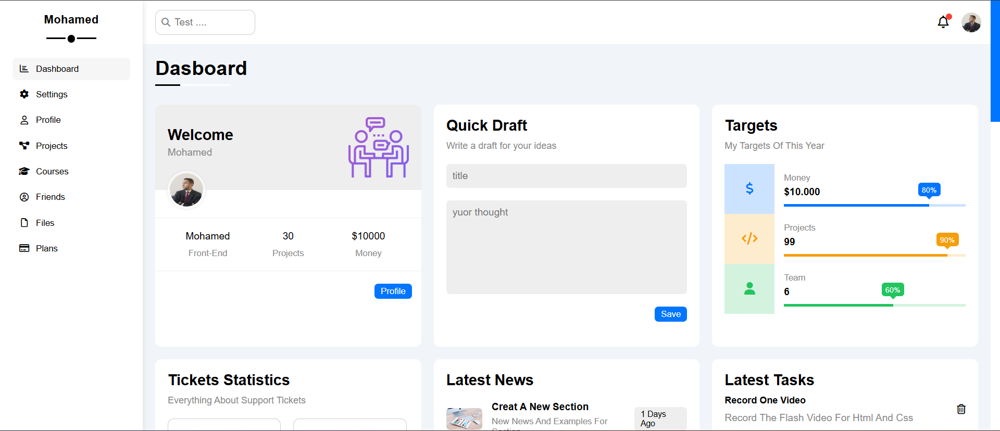

# Dashboard

A front-end dashboard project built with HTML, CSS, and JavaScript.

## Live Demo

[View Dashboard](https://mohamedheseein99.github.io/MainDasboard/)

## About The Project

This project focuses on building a dashboard user interface with a clear layout and organized visual structure. It demonstrates practical front-end development skills and the use of core web technologies to create a web interface.

## Technologies Used

* HTML5
* CSS3
* JavaScript

## Key Highlights

* Dashboard user interface
* Structured page layout
* Styling and layout using CSS
* JavaScript for front-end functionality, where implemented

## Getting Started

To run the project locally:

1. Clone this repository.
2. Open the project folder.
3. Open `index.html` in your browser.

## Author

**Mohamed Hussein**

* GitHub: [mohamedheseein99](https://github.com/mohamedheseein99)
* Portfolio: [View My Portfolio](https://mohamedheseein99.github.io/Mohamed-Hussein-portfolio/#Contact)

---

Built as a front-end development project using HTML, CSS, and JavaScript.
